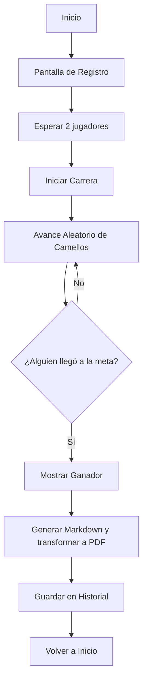
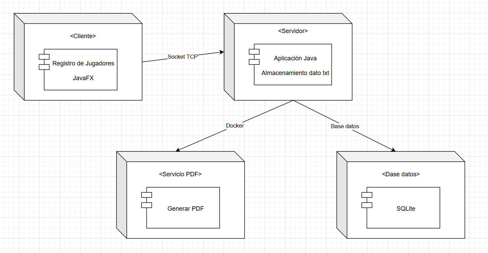
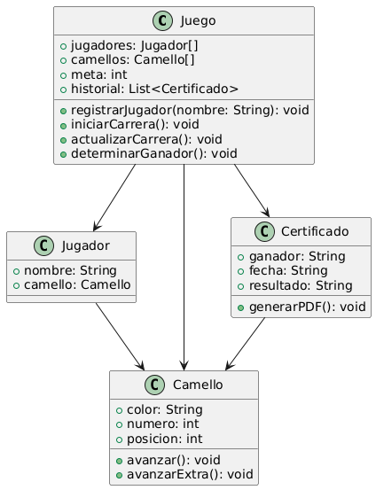

# PSP_FeriaCarreraCaballos
# índice
- [Introducción](#introducción)
    - [Objetivo del juego](#objetivo-del-juego)
    - [Características principales](#características-principales)
- [Análisis y prototipo](#análisis-y-prototipo)
    - [Análisis](#análisis)
        - [Requisitos Funcionales](#requisitos-funcionales)
        - [Requisitos No Funcionales](#requisitos-no-funcionales)
    - [Prototipo](#prototipo)
        - [Diagrama de Flujo](#diagrama-de-flujo)
        - [Diagrama de Despliegue](#diagrama-de-despliegue)
        - [Diagrama de Clases](#diagrama-de-clases)
        
# Introducción
## Objetivo del juego
Dos jugadores competirán para llegar primero a la meta. Cada jugador tendrá un camello asignado y deberá registrarse con un nombre único. El juego avanzará automáticamente, moviendo los camellos hasta que uno de ellos cruce la línea de meta y gana un certificado de ganador.

## Características principales
- **Registro de jugadores:**
    - Cada jugador ingresa su nombre antes de comenzar la partida.
    - Pueden conectarse desde dispositivos diferentes ( En red local o en línea).

- **Dinámica del juego:**
    - Los camellos avanzarán automáticamente y en turno aleatoria.
    - El primer camello en llegar a la meta gana la partida.

- **Premio y certificado:**
    - El jugador ganador podrá generar e imprimir un PDF con un certificado de victoria personalizado.

- **Ventajas especiales (opcional):**
    - Los jugadores recibirán avances extra durante la carrera bajo ciertas condiciones (ejemplo: por respuestas correctas en preguntas aleatorias, por tiempo de reacción, etc.).

- **Interfaz gráfica intuitiva:**
    - Habrá una interfaz fácil de usar para que los jugadores puedan interactuar con el juego y ver el progreso de la carrera.

- **Historial de partidas:**
    - El juego llevará un registro de resultados para consulta futura.

# Análisis y prototipo

## Análisis

### Requisitos Funcionales

- **Registro de jugadores:**
    - Cada jugador ingresa su nombre antes de comenzar

- **Asignación de camellos:**
    - Cada jugador tiene un camello con atributos (color, numero.)

- **Mecánica de carrera:**
    - Movimiento automático con avances aleatorios
    - Posibilidad de "avances extra" por condiciones especiales (ej: minijuegos, respuestas rápidas)

- **Determinación del ganador:**
    - El primer camello en alcanzar la meta (ej: 100 pasos) gana

- **Generación de certificado:**
    - El ganador puede descargar un PDF con su nombre, fecha y resultado

- **Interfaz gráfica (GUI):**
    - Pantalla de inicio (registro)
    - Tablero de carrera (visualización de avances)
    - Panel de resultados (ganador, historial)

- **Persistencia de datos:**
    - Guardar historial de partidas en base de dato o fichero plano(ganadores, tiempos, etc.)

### Requisitos No Funcionales

- **Diseño de interfaz:**
    - Interfaz echo por SceneBuilder de JavaFX

- **Comunicación en red (opcional):**
    - Posibilidad de jugar en red local o en línea (con sockets)

- **Generación de PDF:**
    - Se genera en markdown y se convierte a PDF con Doker.

- **Base de datos simple:**
    - SQLite o txt para almacenar historial

## 2. Prototipo

### Diagrama de Flujo

### Diagrama de Despliegue

### Diagrama de Clases

